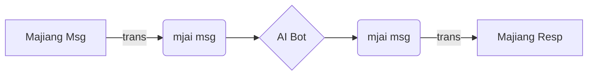

# Majiang_bot
Net-play AI bot for 電脳麻将(Majiang), with majiang-mjai protocal translator

## Introduction

Connect Mortal AI bots (following [mjai protocol](https://mjai.app/docs/mjai-protocol)) to 電脳麻将(Majiang) net play server

You can practice Mahjong with Mortal (or other `mjai` AI bots) in your own private, offline, open-source server.

This project implements a Majiang net-play websocket client in python.

As the [protocol](https://github.com/kobalab/majiang-core/wiki) in Majiang is different from `mjai`, this project implements a translator for the two protocols.



## Get Started

### Install Requirements

```bash
pip install python-socketio[client] numpy requests
```

 `torch` and `libriichi` is also required, install them in the way you like

> For `libriichi`, please visit [Mortal](https://github.com/Equim-chan/Mortal/tree/main/libriichi) project and build it yourself
>
> Then put `libriichi.pyd` in this folder
>
> Double check if you have to use third-party built or modified `libriichi`  binaries

### About params

`-n` `--number` : Start this number of bots and join the room at the same time. Default: `3`

`-p` `--modelpath` : Path to your local Mortal model. Default: `model.pth`

> You can get a Mortal model for free from [Akagi](https://github.com/shinkuan/Akagi/) Project's discord server, or train it yourself

`-r` `--room` : The room ID to let the bots join. You should create a room in advance.

`-s` `--server` : You can start your own Majiang server or use the socket from [official demo site](https://kobalab.net/majiang/netplay.html). Default: `https://kobalab.net/`

`-a` `--apppath` : The path to Majiang app in the webroot. Default: `majiang/`

> Auth address: `server` `apppath` `server/auth/`  eg. `https://kobalab.net/` `majiang/` `server/auth/`
>
> Socket address: `server` `apppath` `server/socket.io/`  eg. `https://kobalab.net/` `majiang/` `server/socket.io/`
>
> Make sure there is a `/` separating the paths

> You can get the server and related setup instructions from [kobalab/majiang-server](https://github.com/kobalab/majiang-server)
>
> Example start cmd (run in server folder, put Majiang and majiang-server in the same parent folder) 
>
> ```bash
> node .\bin\server.js -p 8000 -d ../Majiang/dist/ -c /netplay.html
> ```
>
> This will setup a server on `http://127.0.0.1:8000/` 
>
> The game page of this example will be http://127.0.0.1:8000/netplay.html

### Start the bot

The following script will start 3 bots with random names to join room `A1234` in the [official demo server](https://kobalab.net/majiang/netplay.html)

```bash
python majiang_socket_bot.py -p /path/to/your/model.pth -r A1234
```

To join a custom server on `http://127.0.0.1:8000/`

```bash
python majiang_socket_bot.py -p /path/to/your/model.pth -s http://127.0.0.1:8000/ -a '' -r A1234
```

You can start the game after they join.

The bots will **exit immediately** in these conditions:

- The game ends
- The room not exists
- The room is full
- The bot got kicked out
- Other errors

If one bot encounters an error, other bots may not exit automatically. You can kick out bots in the game room to end them.

## Credit

[Equim-chan/Mortal](https://github.com/Equim-chan/Mortal)

[kobalab/Majiang](https://github.com/kobalab/Majiang)

[kobalab/majiang-server](https://github.com/kobalab/majiang-server)

[shinkuan/Akagi](https://github.com/shinkuan/Akagi/)

[latorc/MahjongCopilot](https://github.com/latorc/MahjongCopilot)

[smly/mjai.app](https://github.com/smly/mjai.app)

> You can use [Apricot-S/majiang-log](https://github.com/Apricot-S/majiang-log) to transform Majiang paipu into Tenhou format for further analysis in [mjai-reviewer](https://mjai.ekyu.moe/), etc.

## License

GPLv3